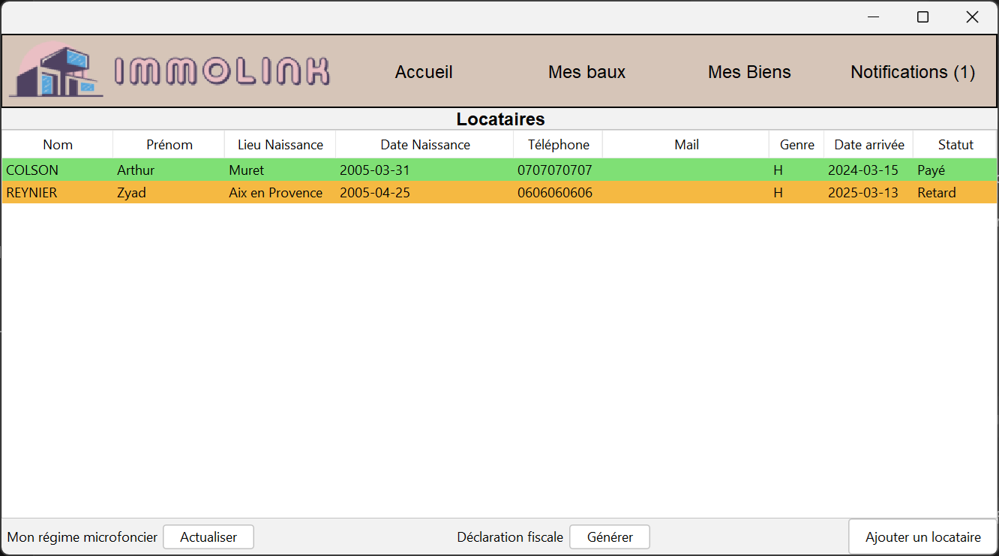

# Immolink

## Description du projet
Ce projet vise à développer une application de gestion de biens immobiliers destinée aux propriétaires privés. L'application simplifie la gestion locative en centralisant des informations importantes (coordonnées des locataires, diagnostics, relevés de compteurs, etc.), en automatisant des processus clés (régularisation des charges, déclaration fiscale).

### Objectifs :
1. **Simplifier la gestion locative** : Centraliser les informations essentielles et automatiser les processus comme la déclaration fiscale et la régularisation des charges.
2. **Suivi des locataires** : Faciliter le suivi des locataires actuels et passés avec un historique complet et des statistiques.
3. **Gestion documentaire et conformité** : Fournir un espace sécurisé pour stocker et organiser les documents liés à la location, tels que les baux, diagnostics, et états des lieux.

## Fonctionnalités principales
- **Gestion des locataires** : Gestion des locataires actuels et archivage des anciens locataires.
- **Automatisation des charges** : Régularisation automatique des charges annuelles, génération de factures et remboursements.
- **Déclaration fiscale** : Automatisation de la déclaration fiscale avec les informations nécessaires (revenus locatifs, travaux, assurances).
- **Règles de gestion des baux** : Augmentation automatique des loyers en fonction de l'indice de l'État et gestion des fins de baux.

## Apperçu visuel de l'application

## Installation
### Prérequis
- Java 8
- Git
- Créer la base de donnée MySQL à l'aide du script SQL à la racine du projet, nommer la base de donnée **immolink**
- Utiliser un outil comme **WAMP** ou **XAMPP** pour activer le serveur en local MYSQL

## Membres de l'équipe de développement
1. **BLATEAU Indi** 
2. **COLSON Arthur**
3. **REVERBEL Clément**
4. **REYNIER Zyad**

## Licence d'utilisation
La licence de Non-Redistribution est disponible à la racine du projet
