# 🏠 Immolink

## 📌 Description du projet

**Immolink** est une application de gestion de biens immobiliers destinée aux propriétaires privés. Elle simplifie la gestion locative en centralisant les informations essentielles (coordonnées des locataires, diagnostics, relevés de compteurs, etc.) et en automatisant des processus clés comme la régularisation des charges ou la déclaration fiscale.

### 🎯 Objectifs

1. **Simplifier la gestion locative** : Centraliser les informations et automatiser les démarches administratives.
2. **Suivi des locataires** : Suivre les locataires actuels et passés grâce à un historique complet et des statistiques.
3. **Gestion documentaire & conformité** : Stockage sécurisé des documents liés à la location (baux, diagnostics, états des lieux...).

> \[!NOTE]
> Immolink est conçu pour offrir une interface intuitive aux propriétaires tout en assurant la conformité réglementaire.

---

## 🚀 Fonctionnalités principales

* **Gestion des locataires** : Suivi et archivage des locataires.
* **Automatisation des charges** : Génération automatique de factures, remboursements, et régularisation annuelle.
* **Déclaration fiscale** : Préparation automatique des données fiscales (revenus locatifs, travaux, assurances...).
* **Règles de gestion des baux** : Ajustement automatique des loyers selon l'indice de l'État, gestion des fins de baux.

> \[!TIP]
> L'application supporte plusieurs types de biens (bâtiments, maisons, garages, appartements).

---

## 🖼️ Aperçu visuel de l'application

### 👥 Locataires

Page d’accueil avec liste des locataires.

Suivi des loyers payés ou impayés.
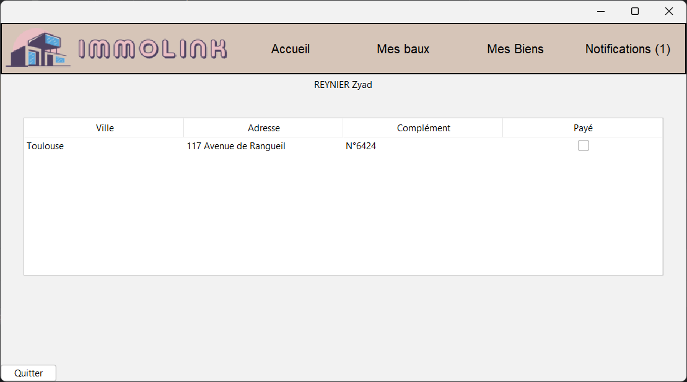

Ajout de nouveaux locataires.
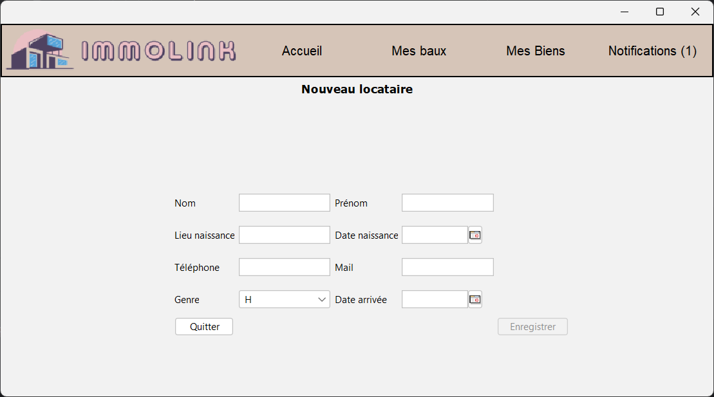

---

### 🏘️ Biens louables

Consultation des biens disponibles à la location.

Création de biens : bâtiments, appartements, maisons, garages.
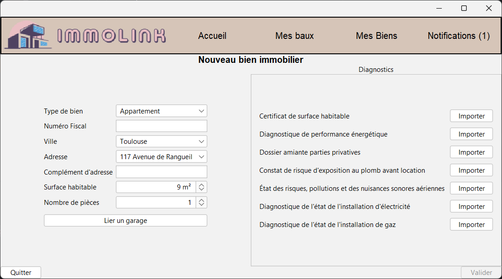

Détail d’un bien avec :

* Modification de diagnostics
* Ajout de travaux
* Liaison à un garage
* Accès aux documents
  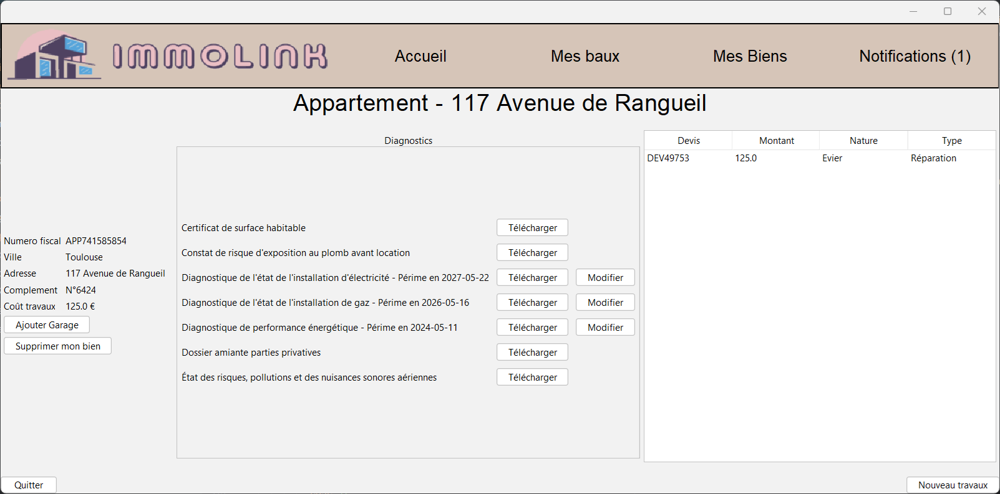

---

### 📑 Baux

Liste des différents baux.
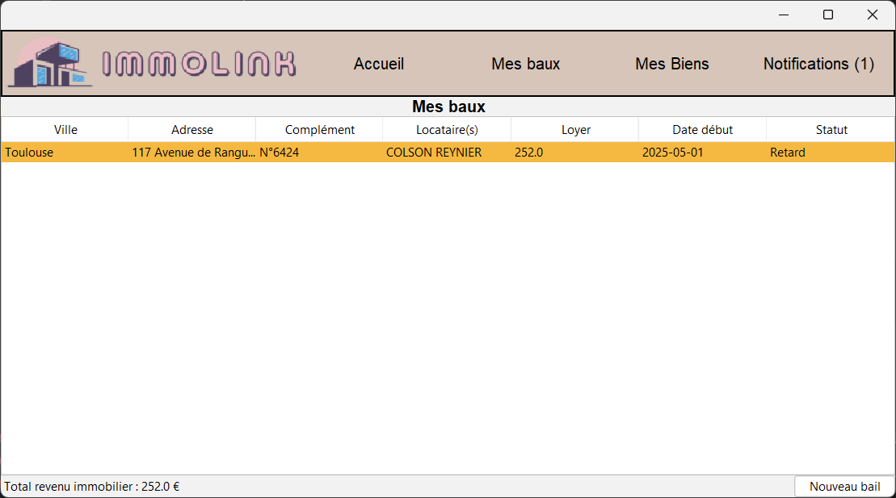

Création d’un bail avec informations clés :

* Loyer, provisions, dépôt de garantie, ICC, index eau
* Locataires et leur quotité
  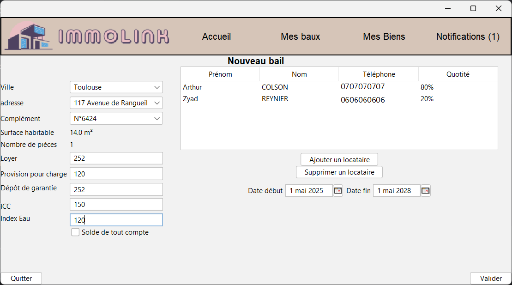

Détail d’un bail avec actions :

* Modification de charges
* Ajout ou suppression de locataires
* Ajustement du loyer à l'anniversaire
* Gestion des charges
  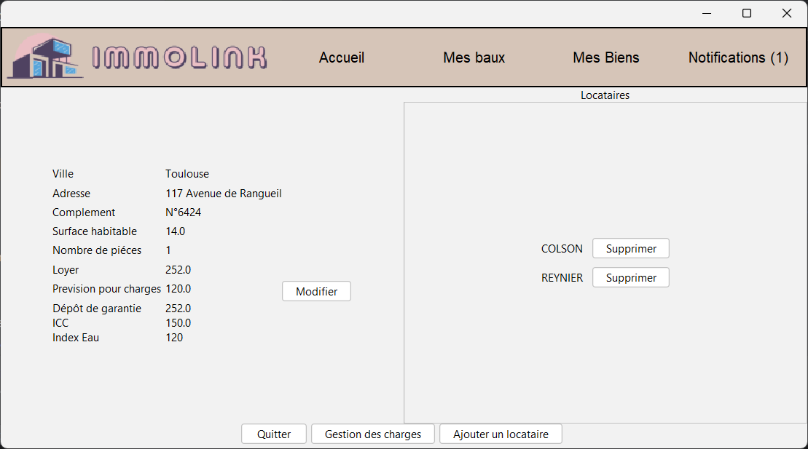

---

### 💸 Charges

Visualisation des charges depuis un bail.
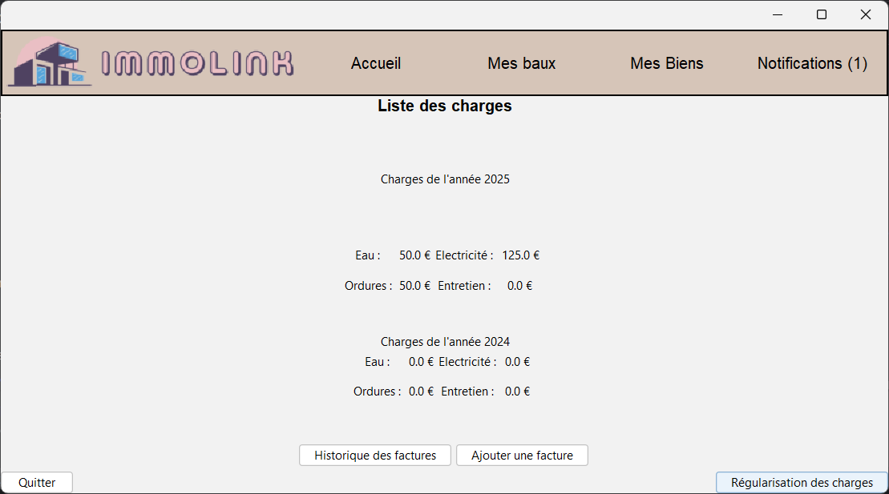

Historique des factures.
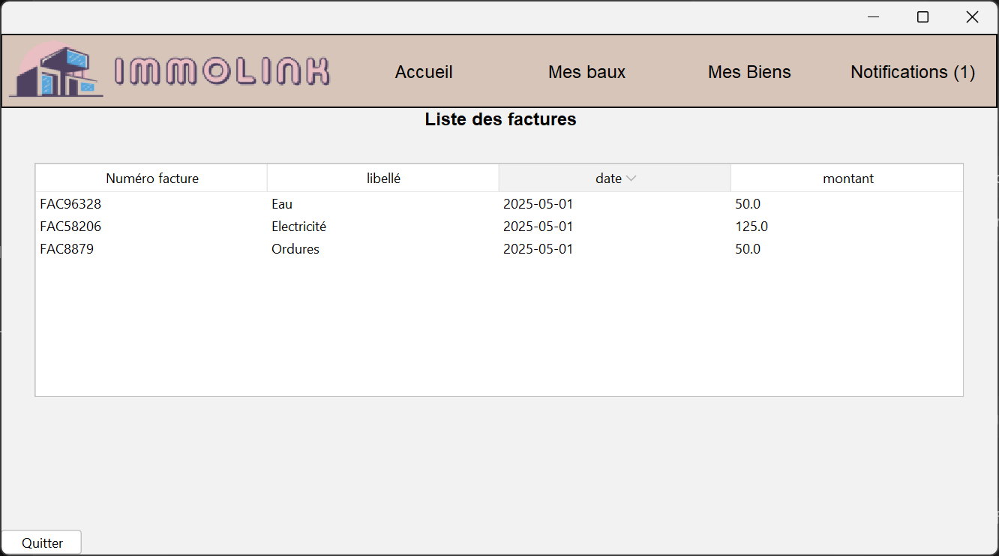

Ajout de nouvelles charges.
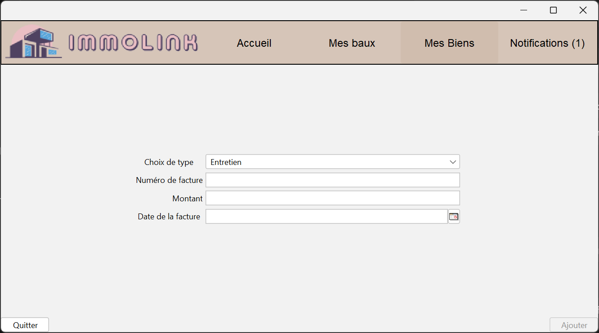

Régularisation annuelle des charges.
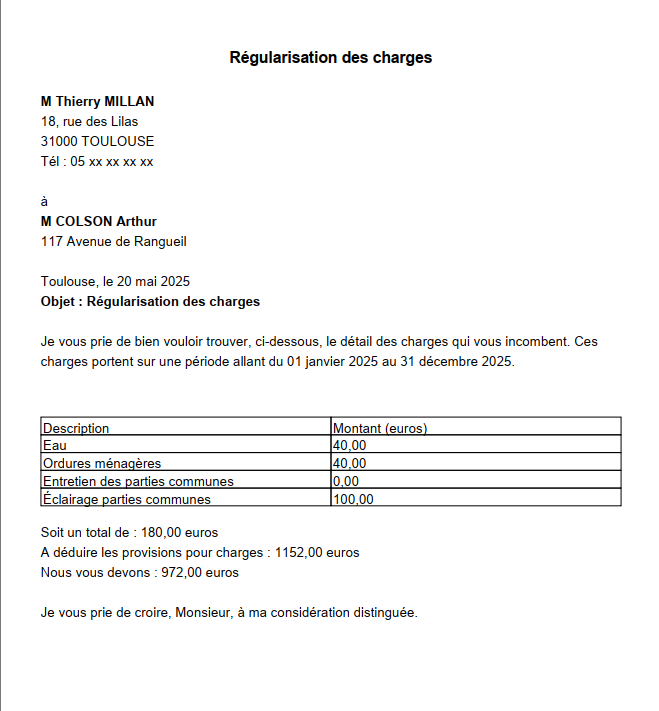

---

### 🔔 Notifications

Alertes sur :

* Fin de bail
* Diagnostics expirés
  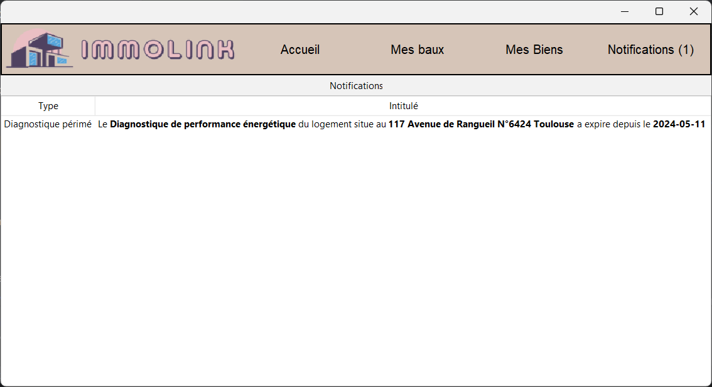

> \[!WARNING]
> Pensez à vérifier régulièrement les notifications pour rester en conformité.

---

## ⚙️ Installation

### Prérequis

* **Java 8**
* **Git**
* **MySQL** (créer une base de données `immolink` à l’aide du script SQL fourni)
* **WAMP** ou **XAMPP** pour activer un serveur local MySQL

> \[!NOTE]
> Le script de création de base se trouve à la racine du projet.

---

## 👨‍💻 Équipe de développement

* **Indi BLATEAU**
* **Arthur COLSON**
* **Clément REVERBEL**
* **Zyad REYNIER**

---

## 📄 Licence

La licence d’utilisation est disponible à la racine du projet.

> \[!NOTE]
> Consultez le fichier `LICENSE` pour plus d’informations sur les droits d’utilisation.
